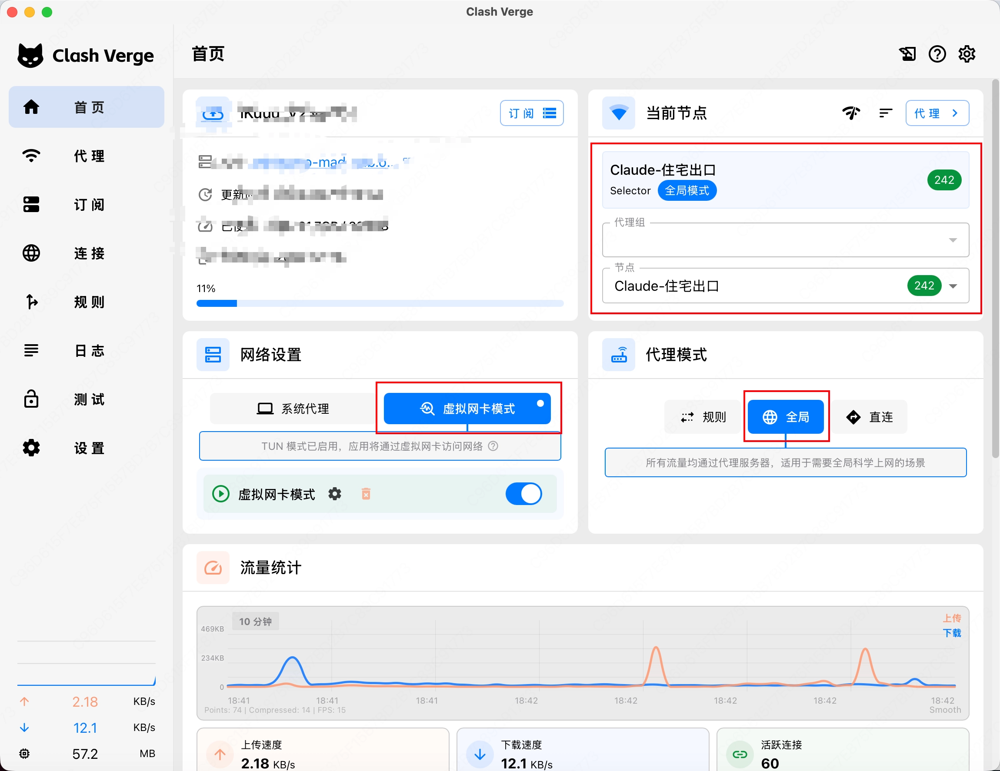
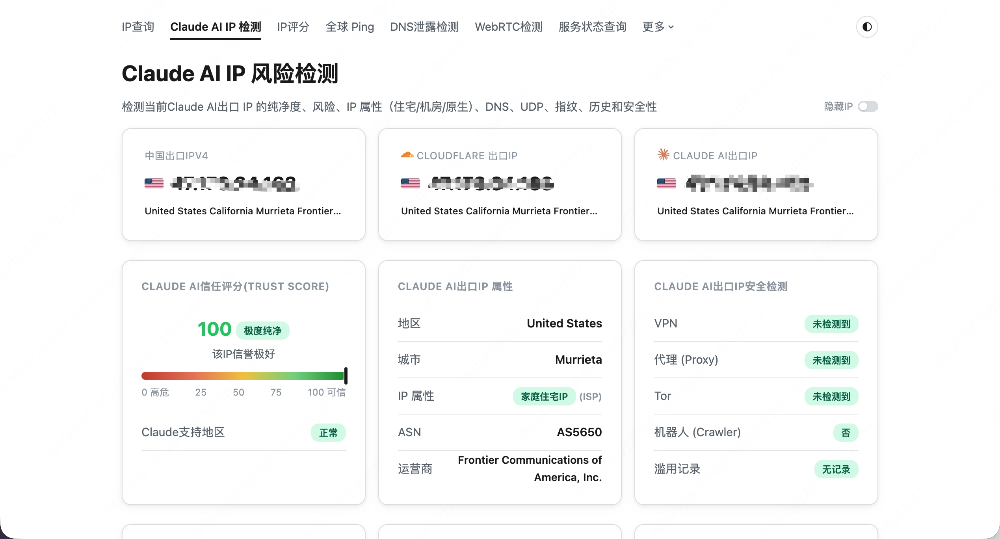

> 背景：6.9 号我从 meituan 走了、得继续用自己的模型，6.10 号 Fable 5 模型发布了，并且 22 号后就只支持 API 调用，于是我本来想着用 codex 进行期末复习转变尝试 cc 了

1. 上 https://www.aaitr.com/clientarea.php 购买 VPS 服务器
2. ssh 登录主机
   1. 在 VPS 上安装 SOCKS5

      ```jsx
      apt update && apt install -y curl tar ufw

      cd /tmp
      curl -L -o gost.tar.gz https://github.com/go-gost/gost/releases/download/v3.2.6/gost_3.2.6_linux_amd64v3.tar.gz
      tar -xzf gost.tar.gz
      install -m 755 gost /usr/local/bin/gost

      PROXY_USER="frontier"
      PROXY_PASS="$(tr -dc 'A-Za-z0-9' </dev/urandom | head -c 24)"
      PROXY_PORT=你的端口

      mkdir -p /etc/gost
      cat > /etc/gost/config.yaml <<EOF
      services:
      - name: socks5
        addr: ":${PROXY_PORT}"
        handler:
          type: socks5
          auth:
            username: "${PROXY_USER}"
            password: "${PROXY_PASS}"
        listener:
          type: tcp
      EOF

      cat > /etc/systemd/system/gost.service <<EOF
      [Unit]
      Description=GOST SOCKS5 Proxy
      After=network-online.target
      Wants=network-online.target

      [Service]
      Type=simple
      ExecStart=/usr/local/bin/gost -C /etc/gost/config.yaml
      Restart=on-failure
      RestartSec=5s

      [Install]
      WantedBy=multi-user.target
      EOF

      systemctl daemon-reload
      systemctl enable --now gost

      ufw allow 22/tcp
      ufw allow ${PROXY_PORT}/tcp
      ufw --force enable

      systemctl status gost --no-pager
      echo "SOCKS5 信息："
      echo "port: ${PROXY_PORT}"
      echo "username: ${PROXY_USER}"
      echo "password: ${PROXY_PASS}"
      ```

3. 选择一个机场节点作为前置节点，记住这个节点名字

4. 打开 Clash Verge 在 `全局扩展脚本 Script`，粘贴下面脚本，注意把 `FRONTIER_PASS` 改成你在 VPS 上安装 SOCKS5 后生成的密码

```jsx
function main(config) {
  const FRONTIER_NAME = "US-Frontier-Residential";
  const DIALER_GROUP = "Frontier-前置机场";
  const CLAUDE_GROUP = "Claude-住宅出口";

  const FRONTIER_HOST = "你的IP地址";
  const FRONTIER_PORT = 你的端口;
  const FRONTIER_USER = "frontier";
  const FRONTIER_PASS = "替换成你的SOCKS5密码";

  const preferredDialers = [
    "🇭🇰 香港S01",
    "🇯🇵 日本S01 | IEPL",
    "🇺🇲 美国S01 | IEPL | x1.5",
    "🇺🇲 美国S02 | IEPL | x1.5",
  ];

  config.proxies = config.proxies || [];
  config["proxy-groups"] = config["proxy-groups"] || [];
  config.rules = config.rules || [];

  const existingProxyNames = new Set(config.proxies.map((p) => p.name));
  const dialerProxies = preferredDialers.filter((name) =>
    existingProxyNames.has(name),
  );

  if (dialerProxies.length === 0) {
    throw new Error("没有找到可用前置机场节点，请检查节点名称");
  }

  config.proxies = config.proxies.filter((p) => p.name !== FRONTIER_NAME);
  config["proxy-groups"] = config["proxy-groups"].filter(
    (g) => g.name !== DIALER_GROUP && g.name !== CLAUDE_GROUP,
  );
  config.rules = config.rules.filter((rule) => !rule.includes(CLAUDE_GROUP));

  config["proxy-groups"].push({
    name: DIALER_GROUP,
    type: "select",
    proxies: dialerProxies,
  });

  config.proxies.push({
    name: FRONTIER_NAME,
    type: "socks5",
    server: FRONTIER_HOST,
    port: FRONTIER_PORT,
    username: FRONTIER_USER,
    password: FRONTIER_PASS,
    udp: false,
    "dialer-proxy": DIALER_GROUP,
  });

  config["proxy-groups"].push({
    name: CLAUDE_GROUP,
    type: "select",
    proxies: [FRONTIER_NAME, DIALER_GROUP, "DIRECT"],
  });

  config.rules = [
    `DOMAIN-SUFFIX,anthropic.com,${CLAUDE_GROUP}`,
    `DOMAIN-SUFFIX,claude.ai,${CLAUDE_GROUP}`,
    ...config.rules,
  ];

  return config;
}
```

1. 配置 Clash Verge

   ```jsx
   代理模式：全局
   当前节点：Claude-住宅出口 / US-Frontier-Residential
   虚拟网卡模式：开启
   IPv6：关闭
   ```

   

2. 最后可以来到 https://ip.net.coffee/claude/ 测一下你的 IP 纯净度

   

iphone 上配置也类似

1. 打开 Shadowrocket 导入你的机场前置节点配置
2. 添加住宅节点

   ```jsx
   Type / 类型：Socks5 或 Socks
   Address / 地址：你买到的 IP 地址
   Port / 端口：你的端口
   User / 用户名：frontier
   Password / 密码：填你 VPS 上 gost 输出的 SOCKS5 密码
   Remark / 备注：US-Frontier-Residential
   ```

3. 往下找找到 “代理通过” 选择你的机场前置节点
